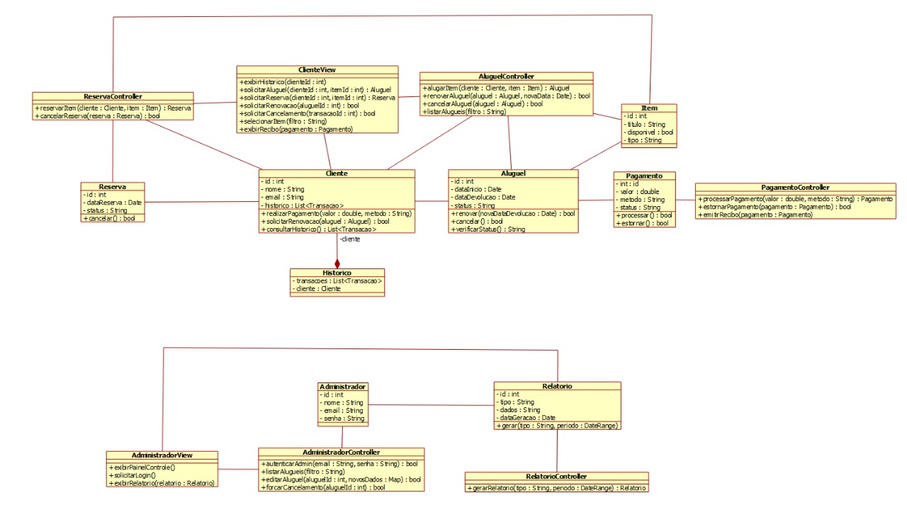

# SistemaPagamentos

Protótipo desktop em Java para demonstrar o gerenciamento local de um catálogo de itens, com operações de aluguel, reserva e acompanhamento de pagamentos simulados. O projeto foi desenvolvido como trabalho acadêmico na disciplina de **Programação Orientada a Objetos (POO)**.

## Proposta

O sistema reúne, em uma aplicação Swing, operações básicas para consultar itens de exemplo, registrar aluguéis e reservas, renovar ou cancelar aluguéis e visualizar relatórios. Ele demonstra como conceitos de orientação a objetos podem ser usados para representar entidades e regras de um domínio pequeno.

Os dados existem somente durante a execução. Pagamentos são simulados localmente: a aplicação não se conecta a instituições financeiras, não processa transações reais e não é um gateway de pagamentos.

## Funcionalidades

- Catálogo de itens de exemplo mantido em memória.
- Criação de aluguel para item disponível; renovação, cancelamento e devolução.
- Reserva de item alugado, com uma reserva ativa por item; após a devolução, o item fica reservado para essa pessoa até que alugue ou cancele a reserva.
- Consulta de aluguéis e histórico de pagamentos do cliente, com exibição de recibo.
- Registro, processamento e estorno de pagamentos simulados no painel administrativo.
- Geração e visualização de relatórios de aluguéis e pagamentos.
- Interface desktop Java Swing com painéis de cliente e administrativo.

## Tecnologias e conceitos

- **Java 21** e APIs padrão do Java.
- **Java Swing** para a interface gráfica.
- Orientação a objetos, com classes de domínio e encapsulamento de estado.
- Organização de responsabilidades em `models`, `controllers` e `views`.
- Enums para categorias e estados, coleções para dados em memória e `Optional` em operações que podem não encontrar resultado.
- Streams para filtrar e transformar coleções.
- `LocalDate` e `LocalDateTime` para representar datas.
- Validações e transições simples de regras de negócio nos modelos e controladores.

O projeto usa Maven para compilação, empacotamento e execução dos testes. JUnit Jupiter é usado somente nos testes. A separação em modelos, controladores e views organiza responsabilidades; as telas chamam controladores e, em alguns fluxos, modelos diretamente, portanto não se apresenta como uma implementação formal de MVC.

## Organização do código

O código-fonte segue a estrutura convencional de Java em `src/main/java/com/sistemadepagamentoealuguel/`:

- `models/`: entidades e estados do domínio, como `Cliente`, `Item`, `Aluguel`, `Reserva`, `Pagamento` e `Relatorio`.
- `controllers/`: criação e consulta de entidades e coordenação das operações em memória de aluguel, reserva, pagamento e relatório.
- `views/`: janelas Swing; `SistemaAluguel` é a entrada principal e compartilha os mesmos controladores entre os painéis.

Essa divisão organiza responsabilidades e não pretende implementar formalmente MVC.

## Requisitos e execução

É necessário ter **JDK 21** e **Maven**. Como a aplicação usa Java Swing, abrir a interface requer um ambiente desktop com suporte gráfico.

Na raiz do repositório, compile e execute os testes:

```bash
mvn clean test
```

Para empacotar o aplicativo:

```bash
mvn package
```

Inicie a aplicação empacotada:

```bash
java -jar target/sistema-pagamentos-1.0.0.jar
```

## Roteiro de demonstração

1. Abra o painel do cliente e alugue um item disponível do catálogo de exemplo.
2. Consulte **Meus Aluguéis** e renove, cancele ou devolva o aluguel.
3. Enquanto um item estiver alugado, registre uma reserva; ao terminar o aluguel, o item fica reservado para essa pessoa. A reserva pode ser cancelada ou convertida em aluguel pelo cliente autorizado.
4. Registre um pagamento simulado e consulte seu recibo/histórico.
5. Abra o painel administrativo para consultar os mesmos aluguéis e pagamentos, registrar/processar/estornar pagamentos e gerar relatórios por período.

O protótipo inicia com um cliente e itens de demonstração. O painel administrativo opera sobre esses registros compartilhados; não há telas de cadastro de usuários nem de autenticação.

## Validação

Os testes automatizados unitários cobrem aluguel, reserva, renovação, devolução, cancelamento, pagamentos, estornos, relatórios, validações e isolamento dos registros por cliente. A interface Swing é validada manualmente; não há testes automatizados de interface. Uma demonstração completa também pode ser feita iniciando o aplicativo com o comando acima e percorrendo os fluxos de cliente e administração.

## Diagrama de classes

O [diagrama de classes atual](docs/diagrama-classes.md) é editável em Mermaid e representa as classes e relações da versão presente no repositório.

### Diagrama preliminar — versão inicial

A imagem abaixo foi produzida durante o desenvolvimento inicial. Ela é mantida como registro histórico e não representa a arquitetura atual.



## Limitações e escopo

- Os dados de catálogo, clientes, aluguéis, reservas e pagamentos são mantidos em memória e se perdem ao encerrar a aplicação; não há persistência.
- Pagamentos são simulados localmente; não são um gateway de pagamentos ou sistema financeiro real.
- O relatório de aluguéis filtra pela data de início do aluguel. Um aluguel iniciado antes do período selecionado pode não aparecer, mesmo que tenha permanecido ativo durante parte dele.
- A estimativa do relatório considera o prazo integral do aluguel e a diária fixa de demonstração de R$ 100,00. Ela não representa receita financeira efetivamente recebida.
- Pagamentos simulados são registros independentes e não são vinculados automaticamente a uma cobrança de aluguel.
- Aluguéis vencidos não mudam de estado automaticamente: permanecem ativos até uma operação manual de devolução ou cancelamento. Essa é uma limitação deliberada do protótipo atual.
- Reservas não expiram automaticamente; o cliente pode cancelá-las pelo painel.
- O painel administrativo não possui autenticação real ou persistente. O acesso atual é uma confirmação para demonstração local das funções administrativas.
- A aplicação é local e não oferece API ou integrações externas.
- Este é um protótipo acadêmico, não um sistema financeiro ou serviço pronto para produção.
