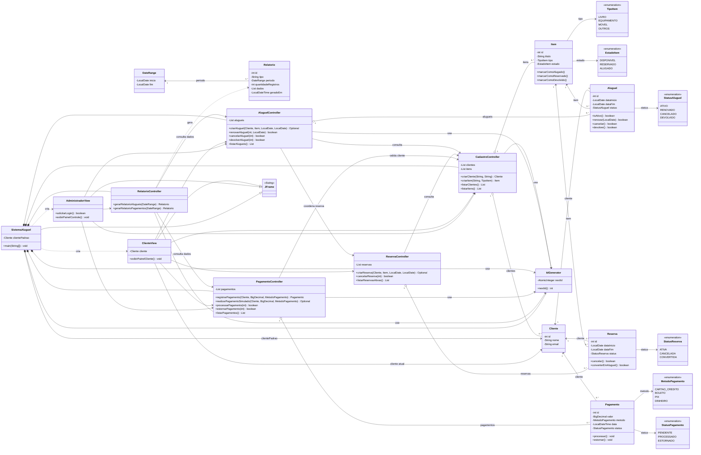

# Diagrama de classes — versão atual

Este diagrama editável representa as classes e relações presentes no código atual. A fonte usa Mermaid e pode ser visualizada diretamente no GitHub.

As multiplicidades indicam as coleções e referências explícitas do código: cada aluguel, reserva e pagamento guarda um cliente; aluguéis e reservas guardam um item; cada relatório guarda um intervalo. `Cliente` não contém coleções próprias desses registros. As associações tracejadas indicam criação/uso sem retenção do objeto correspondente. Os relatórios guardam linhas de texto, não referências diretas aos aluguéis ou pagamentos consultados.
